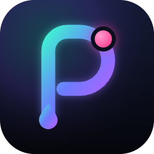
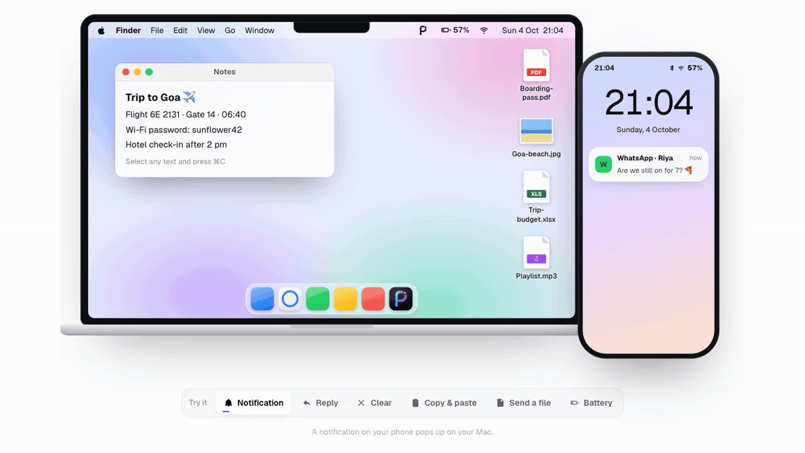
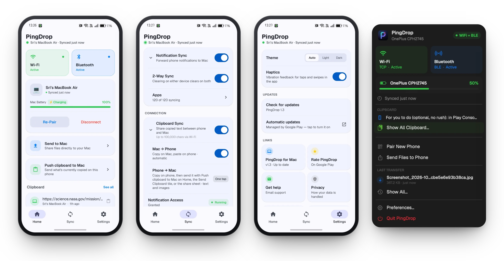

# PingDrop

**Your Android phone, on your Mac.** 
Notifications, clipboard and files — over your own Wi-Fi. No account. No cloud.

  

&nbsp;

&nbsp;

[Website](https://getpingdrop.vercel.app) · [Download](#download) · [PingDrop Pro](#pingdrop-pro) · [Getting started](#getting-started) · [Privacy](#privacy) · [Troubleshooting](#troubleshooting) · [Report a bug](https://github.com/Neerajreddyapi/Pingdrop/issues)

 

▶ <a href="screenshots/demo.mp4">Watch it in HD</a>

> [!NOTE]
> **PingDrop 1.4 is out on Google Play.** The Mac app is coming soon and will be
> published here under [Releases](https://github.com/Neerajreddyapi/Pingdrop/releases) —
> click **Watch → Custom → Releases** at the top of this page to get notified.

## What's new in 1.4

- **Find my phone** — ring your phone from the Mac's menu bar, loudly, even on silent. And
  **Ring my Mac** from the phone, its widget or a Quick Settings tile. Pick the ring sound on
  each device.
- **Send to Phone from Finder** — right-click files → Quick Actions → Send to Phone with PingDrop.
- **Quick Settings tiles** for Send Clipboard and Ring my Mac — add them from Settings → Shortcuts.
- **Tips** on the Home screen for shortcuts you might not know about.
- On the Mac: an optional **Liquid Glass** look (macOS 26+) and a resizable Preferences window.
- **New in PingDrop Pro:** media controls on the Mac, notification history and search,
  a home-screen widget, and auto-send a folder (like Screenshots) to your Mac.
- A clearer PingDrop Pro screen.

## What's new in 1.3.2

- **A fresh new look** — bolder text, cleaner cards and a true black dark mode.
- Text follows your phone's font and size settings.
- Free transfers are up to 2 GB each, with 3 larger ones free to try. PingDrop Pro sends
  any size.
- A clear sheet shows how many free large transfers you have left.
- Smoother screen transitions.

## What's new in 1.3.1

- **A new look** — the new PingDrop icon on Android (including themed icons) and the Mac,
  where the menu bar now shows the PingDrop mark.
- A redesigned PingDrop Pro screen.
- Pro unlocks or refunds take effect as soon as you reopen the app.

## What's new in 1.3

- **PingDrop Pro** — reply from your Mac, notification rules and quiet hours, calendar
  reminders, clipboard images, custom battery alerts, and choose where files are saved.
  [See all Pro features](#pingdrop-pro).
- Stays connected more reliably and reconnects faster.
- Clipboard history, and update checks for the phone and Mac apps.
- New Home, Sync and Settings tabs.

---

## What it does

**Notifications on your Mac.** Messages, mail, anything on your phone shows up on
your desktop. You choose which apps are allowed, one by one. Dismiss a notification
on the Mac and it clears on the phone too.

**Clipboard, both ways.** Copy on the Mac, paste on the phone. Copy on the phone and
send it over with one tap — Push clipboard to Mac, the Quick Settings tile, or the share sheet. Each direction has its
own switch.

**Files, both ways.** Drag files onto the PingDrop icon in your menu bar — or right-click
them in Finder → Send to Phone — to send them to your phone, or share from any Android
app to your Mac. Transfers show live progress and land in Downloads.

**Find my phone.** Ring your phone from the Mac's menu bar — loudly, even on silent —
or ring your Mac from the phone, its widget or a Quick Settings tile.

**Battery at a glance.** Your phone's charge in the Mac menu bar, your Mac's charge in
the phone's notification shade.

**Stays connected.** Wi-Fi when both devices are on the same network, Bluetooth LE
when they aren't. Reconnects on its own when you get home, wake your Mac or unlock
your phone.

**Keeps itself current.** Each app notices when the other one is out of date and
tells you, and the Android app can install its own updates from Google Play.

## Screenshots

  
   
  <b>Home</b> · <b>Sync</b> · <b>Settings</b> on Android &nbsp;—&nbsp; the <b>menu bar panel</b> on the Mac

## Download

| Platform | Get it | Version |
|---|---|---|
| **Android** | [Google Play](https://play.google.com/store/apps/details?id=com.app.pingdrop) |  |
| **Mac** | Coming soon to [Releases](https://github.com/Neerajreddyapi/Pingdrop/releases) | — |

PingDrop is free. The Android app shows a small banner ad and, now and then, a full-screen ad
after a transfer. Free transfers are up to 2 GB each, with 3 larger ones to try. A one-time
**[PingDrop Pro](#pingdrop-pro)** purchase removes the ads and the limit — along with unlocking
everything below.

## PingDrop Pro

Bigger in PingDrop 1.4. One purchase in the Android app — no subscription — unlocks Pro on your phone **and**
your Mac.

| | |
|---|---|
| **No ads** | The banner and full-screen ads in the Android app are gone for good. |
| **Any file size** | Send transfers of any size. Free sends are up to 2 GB each, with 3 larger ones to try. |
| **Reply from your Mac** | Answer a message straight from its notification on the Mac. |
| **Notification rules** | Quiet hours, and Normal, Quiet or Priority for each app — Priority always gets through. |
| **Calendar reminders** | Upcoming events from your Mac's calendars, as reminders on your phone. |
| **Clipboard images** | Copy an image on your Mac, paste it on your phone. Send one back with Push clipboard to Mac. |
| **Custom battery alerts** | Up to 10 alerts each — your phone's battery on the Mac, your Mac's on the phone. |
| **Files your way** | Accept transfers automatically and choose where received files are saved, on both sides. |
| **Media controls** | See what's playing on your phone and play, pause or skip from the Mac's menu bar. |
| **Notification history** | Search every notification from the last 30 days, on your Mac. Kept on the Mac only. |
| **Auto-send a folder** | A folder you select, like Screenshots, goes to your Mac automatically, over Wi-Fi. |
| **Home-screen widget** | Your Mac's battery, plus Send files, Clipboard and Ring Mac, on your phone's home screen. |

## Getting started

1. **On your phone** — install PingDrop from
   [Google Play](https://play.google.com/store/apps/details?id=com.app.pingdrop).
2. **On your Mac** — download `PingDrop.dmg` from
   [Releases](https://github.com/Neerajreddyapi/Pingdrop/releases), open it, and drag
   PingDrop into **Applications**.
3. Open PingDrop on the Mac. It lives in the **menu bar** at the top right, not in the
   Dock.
4. Click the menu bar icon → **Pair New Phone**. A QR code appears.
5. On the phone, tap **Pair with Mac** and scan the code. Allow notification access
   when asked.

Both devices should show **Wi-Fi + BLE** within a few seconds.

## Updating

- **Android** — updates arrive through Google Play, and PingDrop offers to install them
  itself when one is ready.
- **Mac** — download the newest `PingDrop.dmg` from
  [Releases](https://github.com/Neerajreddyapi/Pingdrop/releases) and drag it into
  **Applications**, replacing the old copy. Your pairing is kept. PingDrop on your phone
  lets you know when a newer Mac version is out.

## Requirements

| | |
|---|---|
| Mac | macOS 14 Sonoma or later |
| Phone | Android 7.0 or later |
| Network | Same Wi-Fi network, or Bluetooth in range |

## Privacy

PingDrop is built so your data never has to leave your own devices.

- **No account, no server.** Your phone and your Mac talk directly to each other over
  your local network or Bluetooth. There is nothing in between to store or read your
  data.
- **Encrypted end to end.** Pairing exchanges an AES-256 key through the QR code, and
  everything after that is encrypted with it (AES-256-GCM). The key never leaves the
  two devices.
- **The Mac app makes no internet connections at all.**
- **The Android app shows ads** from Google AdMob — a small banner, and now and then a
  full-screen ad after a transfer — which do use the internet. PingDrop never passes your
  notifications, clipboard or files to the ad network. A one-time **PingDrop Pro** purchase
  removes the ads.
- Clipboard items your password manager marks as sensitive are never sent.
- **Calendar reminders (Pro) are off until you turn them on** and allow calendar access
  on your Mac. Events are read on the Mac and sent, encrypted, only to your paired phone.

Full privacy policy: **https://neerajreddyapi.github.io/Pingdrop/privacy-policy.html**

## Troubleshooting

**The phone won't connect.**
Check both devices are on the same Wi-Fi network, Bluetooth is on, and PingDrop is
running on the Mac — look for its icon in the menu bar. Opening PingDrop on the phone
once also wakes it up.

**Notifications stop after a while.**
Some Android phones stop background apps to save battery. If PingDrop shows
**Battery Optimization Active**, tap **Fix** and let it run unrestricted.

**The Mac asks to find devices on your local network.**
Allow it. That is how the Mac reaches your phone — PingDrop only ever talks to the
phone you paired.

**The Mac's Wi-Fi status keeps dropping.**
Check System Settings → Privacy & Security → Local Network and make sure PingDrop is
switched on. Without it the Mac can hear the phone but can't reply.

**Can I pair more than one phone?**
One phone per Mac. **Pair New Phone** replaces the current one.

## Support

Found a bug or have an idea? [Open an issue](https://github.com/Neerajreddyapi/Pingdrop/issues)
or email **pingdrop.support@gmail.com**.

PingDrop is free. If it saves you a few trips to your phone, you can support its
development at [Buy Me a Coffee](https://buymeacoffee.com/neerajreddy).

---

© 2026 Neeraj Reddy. All rights reserved. PingDrop is free to download and use;
its source code is not published. Android and Google Play are trademarks of Google LLC.
Mac and macOS are trademarks of Apple Inc.
